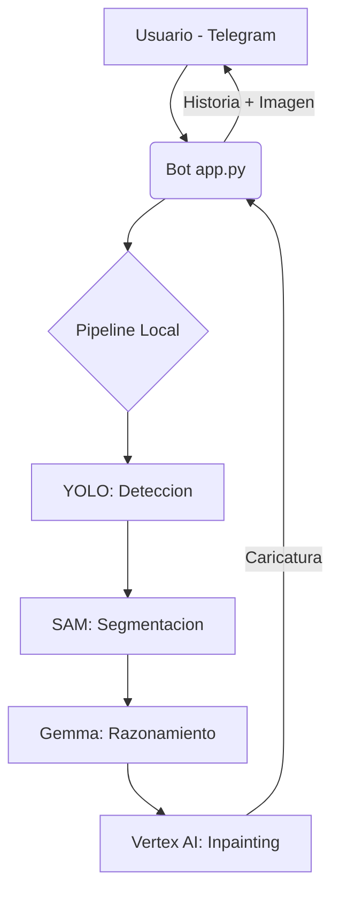

# 🎭 Nano Banana: Drama Bot (Vertex AI Edition)

Este proyecto es una demostración avanzada de un **Pipeline de IA Multimodal Híbrido**. Conecta modelos de detección de objetos, segmentación de precisión, razonamiento visual y generación generativa (Inpainting) en un producto final accesible vía Telegram.

## 🚀 Arquitectura del Sistema

El bot procesa cada imagen a través de cuatro etapas críticas:



1.  **Detección (YOLO11n):** Identifica al usuario en la imagen y genera una caja delimitadora (Bounding Box).
2.  **Segmentación (Mobile SAM):** Realiza un recorte quirúrgico del usuario, separándolo del fondo con precisión a nivel de píxel.
3.  **Razonamiento Visual (Gemma 4 vía Ollama):** Analiza el recorte de la cara, detecta el agotamiento existencial del estudiante de IA y genera:
    *   Una historia sarcástica y personalizada.
    *   Un "Anchor Prompt" técnico para la transformación artística.
4.  **Generación Artística (Vertex AI - Imagen 3.0/4.0):** Utiliza **Inpainting (Masked Editing)** para transformar la cara del usuario en una caricatura estilo "Nano Banana", preservando el fondo original y la identidad del sujeto.

## 🛠️ Requisitos del Sistema

### 1. Variables de Entorno (.env)
Crea un archivo `.env` en la raíz con:
```env
TELEGRAM_TOKEN=tu_token_de_botfather
GOOGLE_PROJECT_ID=tu-proyecto-gcp
GOOGLE_LOCATION=us-central1
```

### 2. Autenticación de Google Cloud
Es necesario tener instalado el Google Cloud SDK y ejecutar:
```bash
gcloud auth login
gcloud auth application-default login
```

### 3. Dependencias
```bash
pip install python-telegram-bot ultralytics opencv-python ollama google-genai python-dotenv numpy
```

## 📂 Estructura de Archivos
*   `app.py`: Interfaz de Telegram (Asíncrona). Maneja el flujo de mensajes y el parseo de Markdown.
*   `pipeline.py`: El corazón del sistema. Orquestra la lógica de YOLO, SAM y las llamadas a Vertex AI.
*   `weights/`: Directorio para los pesos de los modelos (`yolo11n.pt`, `mobile_sam.pt`).

## 🎓 Uso Pedagógico
Este bot sirve para demostrar:
- **Encadenamiento de Modelos:** Cómo la salida de un modelo (YOLO) sirve de entrada para otro (SAM).
- **Inpainting vs Text-to-Image:** La diferencia entre generar una imagen desde cero y editar una existente respetando el contexto.
- **Prompt Engineering Multicapa:** Cómo guiar a un LLM para generar prompts técnicos que mantengan la identidad del usuario.

---
> **Nota:** Este proyecto requiere una cuenta de Google Cloud con la API de Vertex AI habilitada.
